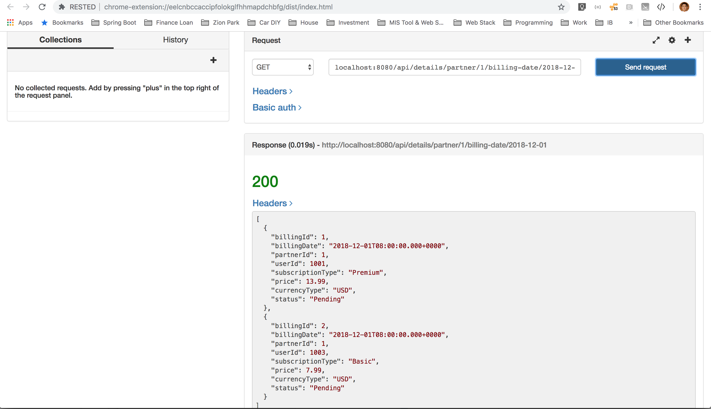

# Billing Service
Provide Partner the ability to retrieve list of charges and respond with either “Approval” or “Decline”

### Running Billing Service
1. Open Eclipse
2. File -> Import -> Existing Maven Project
3. Goto BillingApplication.java
4. Run as Java Application

### Examples
1. Retrieve Billing Details with PartnerId 1, COMCAST

```
[GET]
localhost:8080/api/details/partner/1/billing-date/2018-12-01
```


2. Approve or Decline by PartnerId and BillingId

```
[POST]
localhost:8080/api/approve/partner/1/billing/1
localhost:8080/api/approve/partner/1/billing/2
```


3. Approve or Decline All by PartnerId and Billling Date 

```
[POST]
localhost:8080/api/approve-all/partner/1/billing-date/2018-12-01
localhost:8080/api/decline-all/partner/1/billing-date/2018-12-01
```


4. Result 


### Running the tests
1. Goto BillingApplicationTests.java
2. Run as JUnit Test

### Test coverage
Testing Billing Service api end points and expected response

### Assumptions
The billing objects are retrieved from BillingMonthly entity/table;
assuming there's an existing job/process that will pull billable user charges for current month based on user subscription start date into this BillingMonthly entity/table e.g. this service is pre-ingested with 2018 December billing data.

### Questions?
stevenhorngyen@gmail.com
